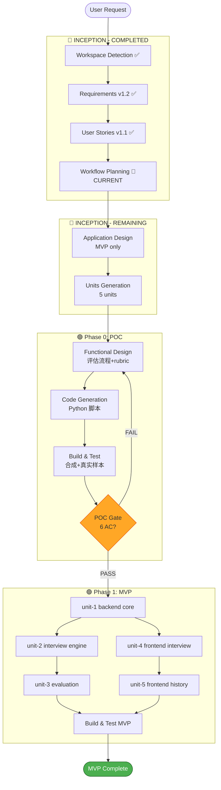

# Workflow Planning — Mock Interview Platform

**Date**: 2026-04-25
**Status**: Pending Approval

---

## 1. Execution Strategy

基于 Requirements v1.2 和 Stories v1.1，本项目需要**三阶段交付**：

```
┌─────────────────┐   ┌──────────────────────┐   ┌────────────────┐
│ Phase 0: POC    │→ │ Phase 1: MVP          │→ │ Phase 2: Beta  │
│ 评估算法验证     │   │ 核心面试流程          │   │ 认证+管理后台   │
│ 2-3 天          │   │ 4-6 周               │   │ 后续迭代        │
└─────────────────┘   └──────────────────────┘   └────────────────┘
```

**Gate**：Phase 0 必须 PASS 才能进入 Phase 1。

---

## 2. Phase 0: POC 执行计划（本次 AIDLC 的第一个交付 unit）

### 2.1 范围

**唯一 Story**: US-000（验证评估算法可行性）

**单一 Unit**：`poc-evaluation-algorithm`

### 2.2 AIDLC 阶段选择（Phase 0）

| 阶段 | 是否执行 | 理由 |
|---|---|---|
| Application Design | ❌ Skip | POC 是单文件脚本，无组件架构 |
| Units Generation | ❌ Skip | 只有 1 个 unit |
| Functional Design | ⚠️ Minimal | 只定义评估流程和 rubric |
| NFR Requirements | ❌ Skip | POC 无性能/安全要求，仅验证功能 |
| NFR Design | ❌ Skip | 同上 |
| Infrastructure Design | ⚠️ Minimal | 只需说明用哪些 AWS 服务（已在 requirements Section 11） |
| Code Generation | ✅ Execute | 核心交付 |
| Build and Test | ✅ Execute | 必须实测 POC 验收标准 |

**Phase 0 节奏**：Functional Design（评估流程 + rubric）→ Code Generation（Python 脚本）→ Build & Test（跑合成样本 + 真实样本）→ Gate 验收

### 2.3 Phase 0 产出物

```
poc/                            # 代码（工作区根目录）
├── run_poc.py
├── rubric.py
├── prompt_template.py
├── requirements.txt
└── README.md

aidlc-docs/construction/poc-evaluation-algorithm/
├── functional-design/
│   └── evaluation-flow.md
├── infrastructure-design/
│   └── aws-services.md
└── code/                       # 代码副本/引用
    └── (指向 poc/)

aidlc-docs/construction/phase0-poc/
├── poc-plan.md
├── rubric.md                  # rubric 详细定义
├── samples/                   # 音频样本
├── results/                   # 评估结果
└── poc-verdict.md            # PASS/FAIL 报告
```

---

## 3. Phase 1: MVP 执行计划

### 3.1 范围

**Stories**: US-001 ~ US-011, US-015 ~ US-017（11 个 Must）
Should stories（US-002, US-003, US-012 ~ US-014）延后到 MVP v1.1

### 3.2 Units Decomposition（MVP）

基于组件边界 + 团队并行可能性，MVP 拆分为 **5 个 units**：

| Unit | 描述 | 依赖 | Stories |
|---|---|---|---|
| **unit-1-backend-core** | FastAPI 骨架 + WebSocket + Bedrock 接入 + DB Schema | Phase 0 | 基础设施 |
| **unit-2-interview-engine** | 面试编排逻辑（Nova Sonic 对话流、问题生成） | unit-1 | US-004, US-005, US-007, US-008 |
| **unit-3-evaluation-pipeline** | 评估引擎（复用 POC 算法，集成到后端） | unit-1, Phase 0 | US-015, US-016, US-017 |
| **unit-4-frontend-interview** | Next.js 面试页面（设置 + 进行中 + 等待报告） | unit-1 API | US-001, US-004, US-006, US-009 |
| **unit-5-frontend-history** | Next.js 记录列表 + 详情回放 | unit-1 API, unit-3 | US-010, US-011 |

**依赖图**：
```
Phase 0 (POC)
  │
  ▼
unit-1-backend-core
  │
  ├─→ unit-2-interview-engine
  │     │
  │     └─→ unit-3-evaluation-pipeline
  │
  └─→ unit-4-frontend-interview
        │
        └─→ unit-5-frontend-history
```

**并行度**：Phase 0 完成后 unit-1 单独做；unit-1 完成后 **unit-2 + unit-4 可并行**；unit-3 和 unit-5 依赖前置完成。

### 3.3 AIDLC 阶段选择（MVP）

| 阶段 | 是否执行 | 理由 |
|---|---|---|
| Application Design | ✅ Execute | 5 个 unit + 组件边界 + API 契约需明确 |
| Units Generation | ✅ Execute | 已在 Section 3.2 初步划分，需正式产出 |
| Functional Design | ✅ Per-unit | unit-2 (面试流程) 和 unit-3 (评估) 业务逻辑复杂 |
| NFR Requirements | ✅ 集中一次 | 已在 requirements.md NFR 中，per-unit 可简化为引用 |
| NFR Design | ⚠️ Minimal | 仅针对关键 NFR（延迟、成本），不per-unit 展开 |
| Infrastructure Design | ✅ Execute | ECS + S3 + SQLite(EBS) + Bedrock 配置需明确 |
| Code Generation | ✅ Per-unit | 5 次 |
| Build and Test | ✅ Execute | 整体集成测试 |

**深度**：Standard（中等复杂度，不需要 Comprehensive 的完整 ADR 套件，但每个 unit 要有 design doc）

### 3.4 MVP 预估时长

| Phase | 时长 |
|---|---|
| Phase 0 POC | 2-3 天 |
| MVP App Design + Units Generation | 1 天 |
| unit-1 backend core | 3-4 天 |
| unit-2 interview engine | 4-5 天 |
| unit-3 evaluation pipeline（复用 POC） | 2-3 天 |
| unit-4 frontend interview | 4-5 天 |
| unit-5 frontend history | 2-3 天 |
| Build & Test（集成） | 2-3 天 |
| **MVP 合计** | **~4 周（含并行）** |

---

## 4. Phase 2: Beta（不在本次 AIDLC 范围）

Beta 会开启新的 AIDLC workflow cycle，涉及：
- 认证（Cognito）
- 管理后台
- PostgreSQL 迁移
- 技术面试扩展
- 宽松模式

**本次 AIDLC 的终点**：MVP v1.0 交付并通过 Build & Test。

---

## 5. Workflow Visualization



**Text Alternative** (if Mermaid fails):
```
INCEPTION: Workspace Detection ✅ → Requirements ✅ → User Stories ✅ → Workflow Planning 📍
  ↓
Application Design → Units Generation (5 units)
  ↓
Phase 0: Functional Design → Code Gen → Build & Test → [Gate: 6 AC?]
  ↓ PASS
Phase 1 MVP:
  unit-1 backend core
    ↓
  unit-2 interview engine  (parallel with unit-4)
  unit-4 frontend interview
    ↓
  unit-3 evaluation         unit-5 frontend history
    ↓                         ↓
  Build & Test MVP ← ← ← ← ← ←
    ↓
  MVP Complete
```

---

## 6. Key Decisions

| 决策 | 选择 | 理由 |
|---|---|---|
| Phase 0 优先 | ✅ | 用户要求核心算法先行，降低 MVP 风险 |
| MVP 单 unit 还是多 unit | 5 units | 前后端分离 + 后端业务拆分，便于并行 |
| Application Design 做吗 | ✅ | 5 unit 需要明确边界和 API 契约 |
| NFR 要 per-unit 吗 | ❌ | 统一在 requirements.md，避免重复 |
| Should stories 何时做 | MVP v1.1 | 先保证 Must 发布 |
| Beta 纳入本 workflow 吗 | ❌ | Beta 是独立的 AIDLC cycle |

---

## 7. Risks & Mitigation

| 风险 | 概率 | 影响 | 缓解 |
|---|---|---|---|
| Phase 0 POC 失败（算法不可行）| 中 | 高 | Gate 机制 + 预留 2 次 revise 轮次；最坏退到方案 A（纯客观指标） |
| Nova Sonic 在 us-east-1 不稳定 | 低 | 高 | 部署前 POC 已验证；备选 cross-region inference |
| Transcribe Call Analytics 对中文支持 | 中 | 中 | Phase 0.2 必须用中英各一段样本验证 |
| 前后端并行时 API 契约漂移 | 中 | 中 | Application Design 阶段产出 OpenAPI spec + TypeScript client 自动生成 |
| SQLite 并发达到瓶颈 | 低（MVP） | 中 | WAL 模式 + 并发监控告警；达到触发条件启动迁移 |

---

## 8. Approval Request

**本次 Workflow Planning 的建议**：

1. ✅ 保留完整的"Application Design + Units Generation + Per-Unit Execution"路径
2. ✅ Phase 0 作为第一个 unit 优先执行，POC Gate 严格把关
3. ✅ MVP 分 5 unit，backend/frontend 并行以加速
4. ✅ Standard 深度（非 Comprehensive），避免过度设计

**若你同意**：直接回复 **approve**，我会进入 **Application Design** 阶段（Phase 0 不需要，Phase 1 MVP 需要）。

**若你想调整**：
- 减少 unit 数量（如合并前端两个 unit）
- 调整阶段深度
- 其他意见
